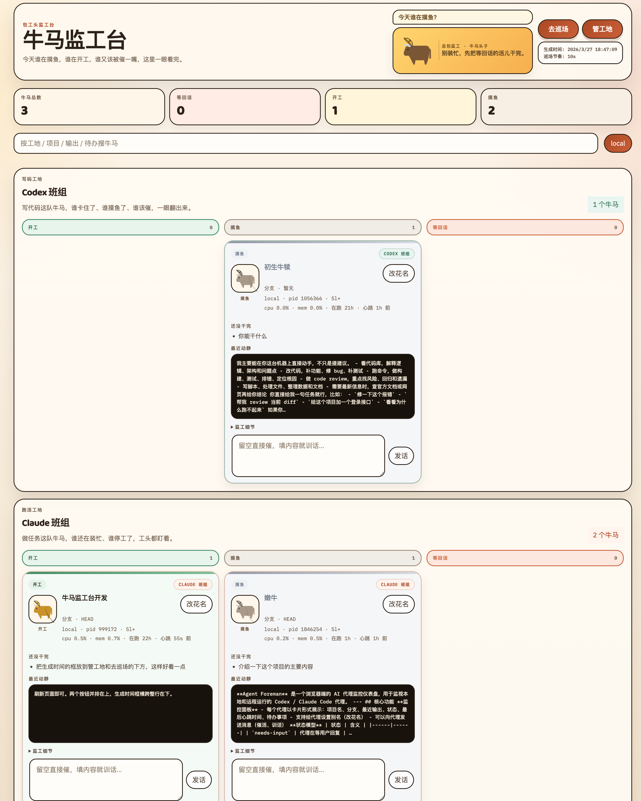

# Agent Foreman · 牛马监工台

[English](#english) | [中文](#中文)

---

<a name="english"></a>

## English

A browser dashboard for monitoring **Codex / Claude Code** AI coding agents in real time.

See which agents are working, waiting for input, or slacking — and send messages to them directly from the browser.




### Features

- Real-time agent monitoring (1s background refresh, no page flicker)
- Status groups: **Needs Input** / **Working** / **Slacking**
- Send messages to agents directly from the browser (press Enter to send)
- Multi-machine: local + remote Linux servers + macOS
- SSH key or SSH password authentication for remote hosts
- Click stat cards to filter agents by status
- Custom nicknames for agents
- Zero Python dependencies (pure stdlib)
- Encrypted credential storage (AES-256)

### Requirements

| Platform | Requirements |
|----------|--------------|
| Linux | Python 3.9+, OpenSSL, OpenSSH, setsid (util-linux, for SSH password mode) |
| macOS | Python 3.9+, tmux (for send feature), psutil (auto-installed) |

### Installation

```bash
git clone https://github.com/operoncao123/agent-foreman.git
cd agent-foreman
cp config.example.json config.json
```

### Start

Run inside tmux so the server keeps running after you close the terminal:

```bash
tmux new-session -s foreman
python3 monitor_server.py --host 0.0.0.0 --port 8787
```

On first run, you will be asked to set a **master password** (used to encrypt remote host credentials). Enter the same password on each subsequent start.

Press `Ctrl+B` then `D` to detach from tmux. Open your browser:

```
http://<your-server-ip>:8787
```

> Make sure port 8787 is open in your firewall or security group.

### Add Remote Hosts

Click **Manage Sites → Add Site** in the dashboard.

Paste SSH format directly — it auto-parses username and host:

```
user@your-server-ip
```

**SSH key (recommended):** set up passwordless login first:

```bash
ssh-copy-id user@your-server-ip
```

Then select **SSH Key** in the form.

**SSH password:** select **SSH Password** and enter your login password. It is stored encrypted.

> The remote machine only needs `python3`. No packages need to be pre-installed.

### Connect macOS

1. Enable Remote Login: **System Settings → General → Sharing → Remote Login**
2. Install tmux: `brew install tmux`
3. Start your agent inside tmux:
   ```bash
   tmux
   claude
   ```
4. Add the Mac as a remote site in the dashboard.

### Sending Messages

- **Enter** — send
- **Shift+Enter** — newline
- **Send empty** — sends a nudge to continue

#### How injection works

> **Linux kernel 6.2+** removed TIOCSTI. On modern kernels the server falls back to tmux (if the agent runs inside tmux) or ptrace. Enable ptrace if needed (see below).

| Platform | Method | Requirement |
|----------|--------|-------------|
| Linux local | tmux → ptrace TIOCSTI | tmux, or same user with ptrace_scope ≤ 1 |
| Linux remote | SSH + tmux → ptrace TIOCSTI | SSH access |
| macOS | SSH + tmux send-keys | Agent must run inside tmux |

#### Linux ptrace permission

```bash
# Temporary
echo 0 | sudo tee /proc/sys/kernel/yama/ptrace_scope

# Permanent
echo 'kernel.yama.ptrace_scope = 0' | sudo tee /etc/sysctl.d/10-ptrace.conf
sudo sysctl -p /etc/sysctl.d/10-ptrace.conf
```

### Configuration

See `config.example.json` for all options. Key fields:

```json
{
  "refresh_interval_sec": 10,
  "send_mode": "stdin",
  "hosts": [{"name": "local", "mode": "local"}],
  "managed_hosts": [],
  "paths": {
    "codex_sessions": "~/.codex/sessions",
    "claude_projects": "~/.claude/projects",
    "claude_todos": "~/.claude/todos",
    "claude_tasks": "~/.claude/tasks"
  }
}
```

### Security

- Passwords encrypted with AES-256-CBC + PBKDF2
- Never stored in `config.json` or returned by APIs
- Vault unlocked only at startup with master password
- Files excluded from git (see `.gitignore`): `config.json`, `credentials.enc.json`, `session_aliases.json`

### License

MIT

---

<a name="中文"></a>

## 中文

实时监控 **Codex / Claude Code** AI 编程 Agent 的浏览器面板。

一眼看出哪个 Agent 在开工、在等回话、在摸鱼，并直接从浏览器向它发话催活。


### 功能

- 实时监控（1秒后台刷新，无页面闪烁）
- 状态分组：**等回话 / 开工 / 摸鱼**
- 直接从浏览器发话（按 Enter 发送）
- 支持本地 + 多台远程 Linux 服务器 + Mac
- SSH 密钥或 SSH 密码两种认证方式
- 点击统计卡片按状态筛选 Agent
- 给 Agent 起花名
- 零 Python 依赖（纯标准库）
- AES-256 加密凭据存储

### 环境要求

| 平台 | 要求 |
|------|------|
| Linux | Python 3.9+，OpenSSL，OpenSSH，setsid（util-linux，SSH 密码模式需要） |
| macOS | Python 3.9+，tmux（发话需要），psutil（自动安装） |

### 安装

```bash
git clone https://github.com/operoncao123/agent-foreman.git
cd agent-foreman
cp config.example.json config.json
```

### 启动

建议在 tmux 里启动，防止关闭终端后服务停止：

```bash
tmux new-session -s foreman
python3 monitor_server.py --host 0.0.0.0 --port 8787
```

首次启动会提示设置 **master password**（用于加密远程主机密码）。之后每次启动输入同一密码。

按 `Ctrl+B` 然后 `D` 挂到后台，浏览器访问：

```
http://<your-server-ip>:8787
```

> 确保服务器防火墙或安全组已放行 8787 端口。

### 添加远程主机

点击「**管工地 → 登记新工地**」。

地址栏支持直接粘贴 SSH 格式，自动解析：

```
user@your-server-ip
```

**SSH 密钥（推荐）：** 先配好免密登录：

```bash
ssh-copy-id user@your-server-ip
```

然后选「SSH 密钥（免密）」。

**SSH 密码：** 选「SSH 密码」，输入登录密码（加密保存）。

> 远程机器只需有 `python3`，无需预装任何包。

### 连接 Mac

1. 开启远程登录：**系统设置 → 通用 → 共享 → 远程登录**
2. 安装 tmux：`brew install tmux`
3. 在 tmux 里启动 Agent：
   ```bash
   tmux
   claude
   ```
4. 在网页添加工地

### 发话功能

- **Enter** — 发送
- **Shift+Enter** — 换行
- **留空发送** — 催 Agent 继续干活

#### 各平台注入方式

> **Linux 内核 6.2+** 已移除 TIOCSTI。新版内核上会自动回退到 tmux（如果 Agent 在 tmux 里运行）或 ptrace，必要时请开启 ptrace（见下方说明）。

| 平台 | 方式 | 前提 |
|------|------|------|
| Linux 本地 | tmux → ptrace TIOCSTI | tmux，或同用户且 ptrace_scope ≤ 1 |
| Linux 远程 | SSH + tmux → ptrace TIOCSTI | SSH 可达 |
| macOS | SSH + tmux send-keys | Agent 在 tmux 里运行 |

#### Linux ptrace 权限

```bash
# 临时
echo 0 | sudo tee /proc/sys/kernel/yama/ptrace_scope

# 永久
echo 'kernel.yama.ptrace_scope = 0' | sudo tee /etc/sysctl.d/10-ptrace.conf
sudo sysctl -p /etc/sysctl.d/10-ptrace.conf
```

### 配置说明

参考 `config.example.json`，主要字段：

```json
{
  "refresh_interval_sec": 10,
  "send_mode": "stdin",
  "hosts": [{"name": "local", "mode": "local"}],
  "managed_hosts": [],
  "paths": {
    "codex_sessions": "~/.codex/sessions",
    "claude_projects": "~/.claude/projects",
    "claude_todos": "~/.claude/todos",
    "claude_tasks": "~/.claude/tasks"
  }
}
```

### 安全说明

- 密码通过 AES-256-CBC + PBKDF2 加密存储
- 密码不出现在 `config.json` 或任何 API 响应中
- vault 仅在启动时输入 master password 后解锁
- 以下文件不会被提交（已在 `.gitignore` 中）：
  - `config.json`
  - `credentials.enc.json`
  - `session_aliases.json`

### License

MIT
